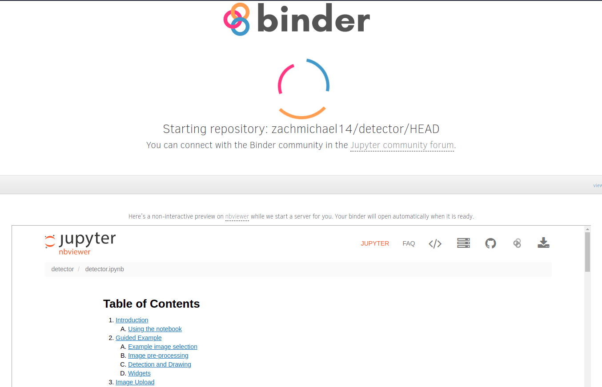
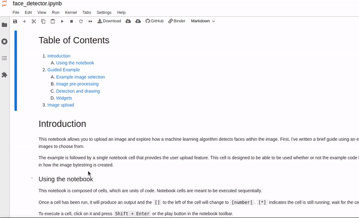
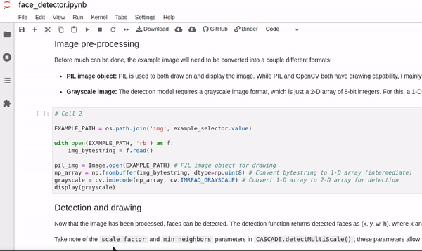
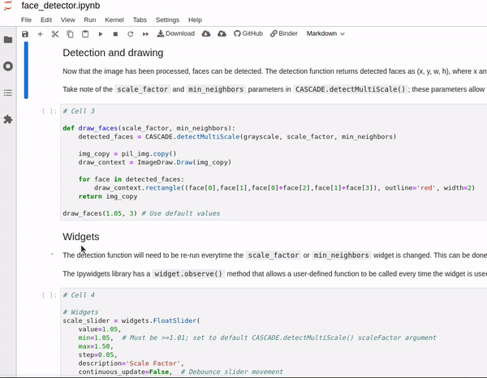
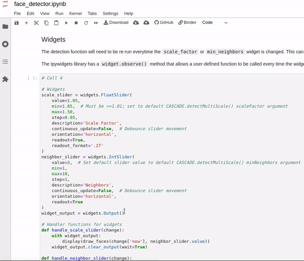
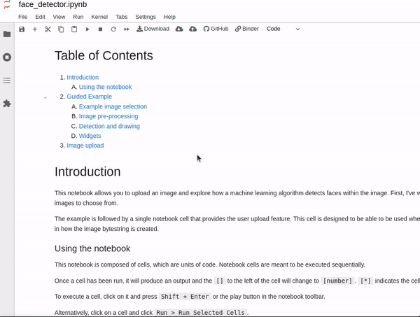
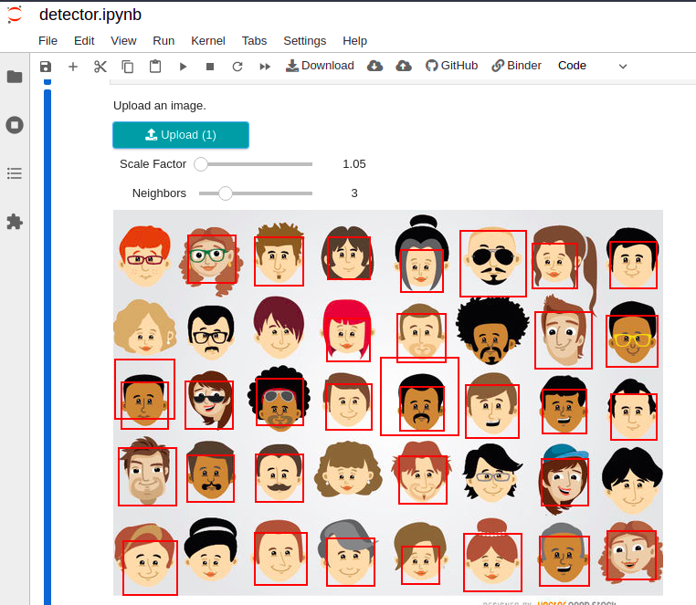
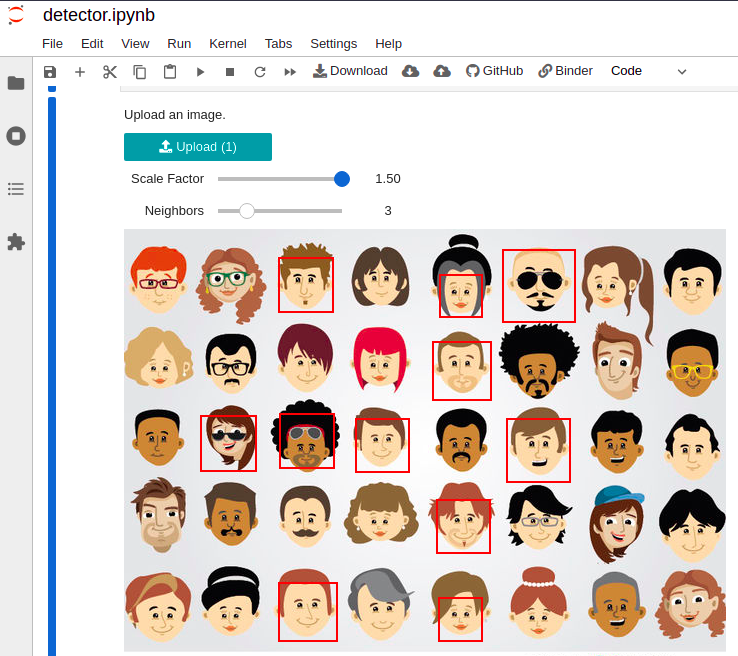
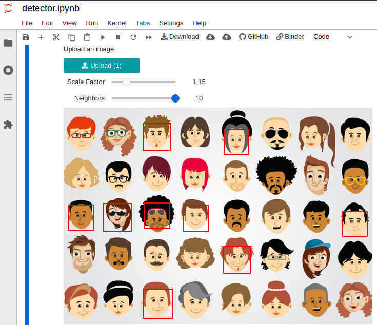

# Detect faces in images with OpenCV

## Table of Contents

<ol>
 <li><a href="#introduction">Introduction</a></li>
 <ol>
  <li><a href="#the-model">The model</a></li>
 </ol>
 <li><a href="#technologies">Technologies</a></li>
 <li><a href="#usage">Usage</a></li>
  <ol>
   <li><a href="#start-the-notebook">Start the notebook</a></li>
   <li><a href="#guided-example">Guided example</a></li>
   <li><a href="#upload-a-photo">Upload a photo</a></li>
   <li><a href="#adjusting-model-sensitivity">Adjusting model sensitivity</a></li>
  </ol>
 <li><a href="#further-reading">Further reading</a></li>
 <li><a href="#author">Author</a></li>
 </ol>

## Introduction <a class="anchor" id="introduction"></a>

The goal of this project was to utilize some common data science tools and explore a few different deployment methods for ML models. I utimately settled on a Jupyter Notebook deployed using Binder.

The notebook contains a guided example using images stored in the ```img``` directory and also allows the user to upload their own photo for detection.

#### The model <a class="anchor" id="the-model"></a>

During training, each model defines an expected object size. In this case, the model expects face objects to be 24x24 pixels. Since people within an image are often a variable distance from the camera, their faces appear to be different sizes and thus may be outside the expected size. In order to maximize the chances that an object will fit the given size, the detection model makes several passes over the image, resizing the image before each pass.

There are two parameters, minSize and maxSize, that allow for finer control of the object size, but they're not strictly necessary here. 

Instead, this notebook focuses on two other parameters, *scale factor* and *minimum neighbors*. See <a href="#adjusting-model-sensitivity">adjusting model sensitivity</a> for more information.

## Technologies <a class="anchor" id="technologies"></a>

* Python
* Binder
* Jupyter notebooks
* Ipywidgets
* Numpy
* PIL/pillow

## Usage <a class="anchor" id="usage"></a>

### Start the notebook <a class="anchor" id="start-the-notebook"></a>

1. Click the badge below to start the notebook.
    - [](https://mybinder.org/v2/gh/zachmichael14/detector/HEAD?labpath=face_detector.ipynb)
    - A static version of the notebook will be displayed while the server spins up. 
  
 
 
### Guided Example <a class="anchor" id="guided-example"></a>

1. Run the first code cell and select an example image to use from the dropdown box. The selected image will be displayed in the cell output.



2. Running the next cell pre-processes the image and outputs the 2-D array required by the detection model.



3. The following cell will run the detection model on the chosen image using default values.



4. The [sensitivity](#adjusting-model-sensitivity) of the model can be adjusted by running cell four and using the sliders that appear.



### Upload a photo <a class="anchor" id="upload-a-photo"></a>

 1. Click the badge below to start the notebook.
    - [](https://mybinder.org/v2/gh/zachmichael14/detector/HEAD?labpath=detector.ipynb)
    - A static version of the notebook will be displayed while the server spins up. 
 
 
 
 2. Click "Image Upload" in the Table of Contents.
 3. Run the cell by clicking on it and using either ```Shift + Enter``` or the play button in the toolbar.



 5. Upload an image using the upload button that appears after running the cell. Accept formats include .jpg/.jpeg and .png. The detection model will automatically run using default values. 

 
 
 6. Adjust the model's sensitivity to see how detection changes (see below).

### Adjusting Model Sensitivity <a class="anchor" id="adjusting-model-sensitivity"></a>

The sensitivity and speed of the model is affected by some important parameters: *scale factor* and *minimum neighbors*.

#### Scale factor

Scale factor determines how much the model decreases the size of the image before each pass. Practically speaking, a lower scale factor value means a less dramatic resize at each step, so the model is more sensitive but also slower. Best results tend to be found around 1.1-1.2.



#### Minimum neighbors

The effect of minimum neighbors is a bit more straightforward, as it's essentially a direct indicator of the model's sensitivity. This value determines the minimum number of detections a face object must have before it's considered a match. Practically, a higher minimum neighbors value means fewer faces are likely to be detected, but it also typically results in fewer false positives.


 

## Further reading <a class="anchor" id="further-reading"></a>

- OpenCV Haar cascade: https://docs.opencv.org/3.4/db/d28/tutorial_cascade_classifier.html

## Author <a class="anchor" id="author"></a>

### Zachary Seitz

#### Let's connect!

* Find me on [Linkedin](https://linkedin.com/in/zachmichael14).
* Email me at zachmichael14@gmail.com.
* Visit my [resume website](https://zachmichael14.github.io/gh_page/).
